### Home Assistant & Grenton cz. 1

W tym tutorialu przedstawiona została integracja Home Assistant z systemem Grenton za pomocą RESTful API oraz sterowanie urządzeniem za pomocą Google Home / Asystent Google.

Szczegółowe informacje jak zainstalować Home Assistant na różnych platformach można znaleźć na stronie: https://www.home-assistant.io/installation/.

W pierwszej części tutorialu przedstawiony został przykład sterowania Lampą (DIMMER DIN) w systemie Grenton za pomocą Home Assistant, Google Home oraz Asystenta Google.


##### 1. Pierwsze kroki

Po zakończeniu konfiguracji konta na ekranie pojawi się widok panelu Home Assistant.

W pierwszej kolejności należy zainstalować dodatek, który ułatwi edytowanie plików `yaml`.  Aby to zrobić należy przejść do zakładki `Supervisor` następnie otworzyć `Add-on Store`.  W pozycji `Official add-ons` należy odnaleźć i wybrać `File editor`.

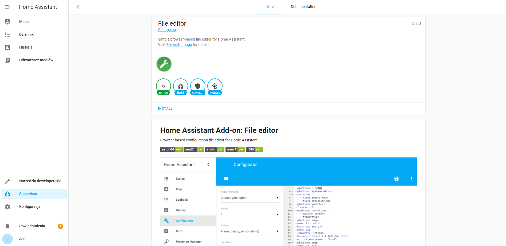

Należy kliknąć `INSTALL`, następnie zaznaczyć opcję `Show in sidebar` oraz uruchomić przyciskiem `START`.


Kolejnym krokiem będzie utworzenie długoterminowego tokenu dostępu, umożliwiającego komunikację z Home Assistantem. Aby utworzyć token należy przejść do profilu i wybrać `UTWÓRZ TOKEN` oraz nadać mu nazwę.

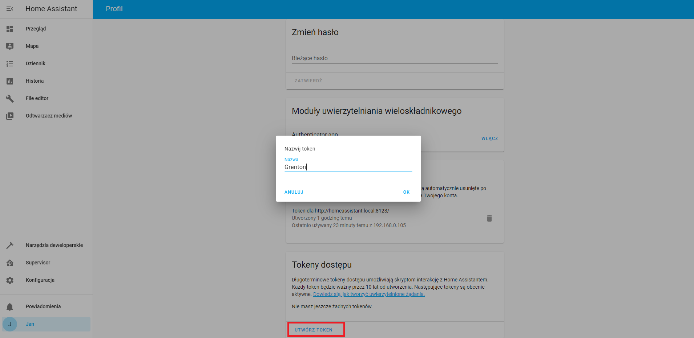

> Należy zapisać token, ponieważ zostaje wyświetlany jednorazowo po utworzeniu.


Ostatnim krokiem będzie włączenie trybu zaawansowanego, który odblokuje dodatkowe funkcje. Tryb jest domyślnie wyłączony, aby go aktywować należy przejść do zakładki Profilu, a następnie włączyć `Tryb zaawansowany`.


> Zalecane jest ustawienie/zarezerwowanie adresu IP dla Home Assistant w sieci lokalnej, aby urządzenie zawsze miało ten sam adres IP. Należy to zrobić w ustawieniach routera (szczegóły w instrukcji routera). Przykładowo dla routera TP-link rezerwowanie znajduje się w zakładce `DHCP->Address Reservation`


##### 2. Konfiguracja szablonu obiektu w Home Assistant

Aby dodać szablon, za pomocą którego będziemy mogli kontrolować obiekt, należy otworzyć `File editor` a następnie wybrać plik `configuration.yaml`.

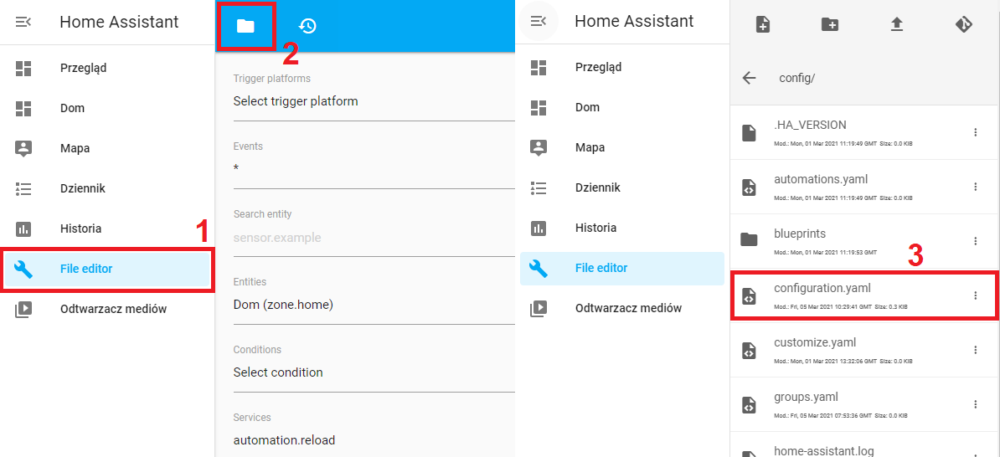


W pliku `configuration.yaml` należy skonfigurować obiekt. Aby dodać szablon obiektu oświetlenia, należy dopisać przykładowy kod:

```yaml
light:
  - platform: template
    lights:
      livingroom_light:
        friendly_name: "Lampa"
        unique_id: livingroom_light
        turn_on:
          service: rest_command.livingroom_light_on
        turn_off:
          service: rest_command.livingroom_light_off
        set_level:
          service: rest_command.livingroom_light_value
          data:
            livingroom_light_brightness: "{{ brightness }}"
```


> Jeśli `unique_id` nie będzie ustawiony, nie będzie możliwości konfiguracji za pomocą interfejsu.

> Komendy `rest_command.livingroom_light...` zostaną skonfigurowane w dalszych krokach.

Aby obiekt został dodany, należy zapisać zmiany w pliku i uruchomić ponownie serwer Home Assistant. Aby to zrobić należy przejść do zakładki `Konfiguracja`, następnie `Kontrola serwera` i `Sprawdź konfigurację`. Jeśli konfiguracja jest prawidłowa można uruchomić ponownie serwer.


Po ponownym uruchomieniu serwera można sprawdzić, czy Encja została prawidłowo dodana. W tym celu należy przejść do zakładki `Narzędzia deweloperskie` i otworzyć kartę `STANY`. W polu bieżących encji powinien pojawić się nowy obiekt "light.livingroom_light".
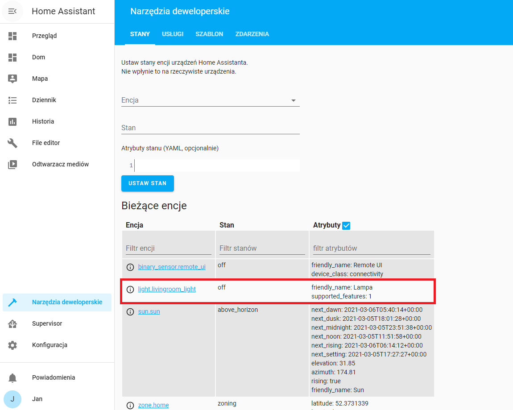


Stworzony obiekt można umieścić w dowolnym Pulpicie w dowolny sposób. Przykładowo można stworzyć nowy Dashboard (Pulpit) w `Konfiguracja` -> `Dashboardy`, a następnie ustawić go jako jako domyślny.

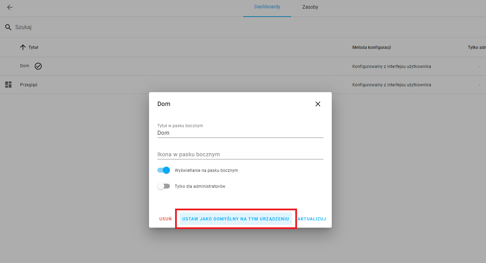


Po wybraniu Pulpitu należy przejść do jego edycji:
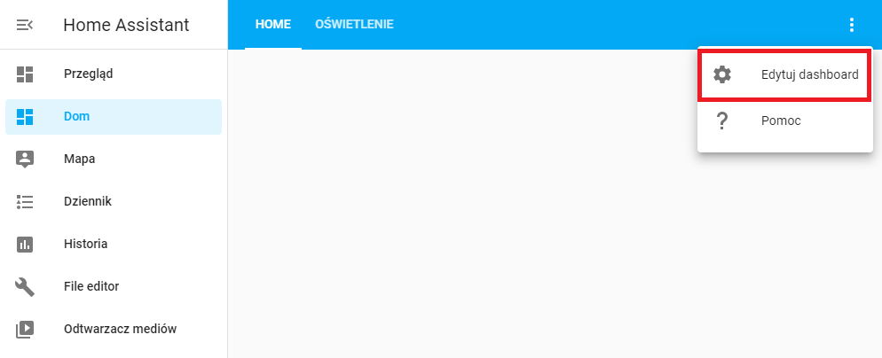

W tym miejscu można dodać obiekt w dowolny sposób, przykładowo:
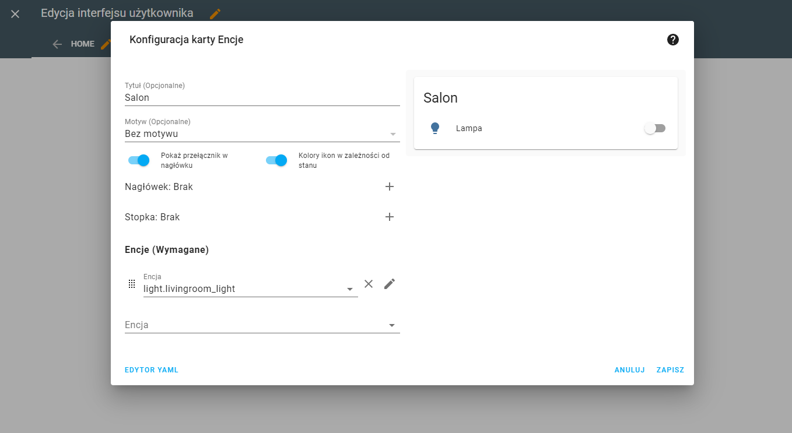


##### 3. Konfiguracja sterownia

###### 3.1. Konfiguracja w Home Assistant

Aby skonfigurować podstawowe komendy RESTful do sterowania stworzonym wcześniej szablonem oświetlenia, w pliku `configuration.yaml` należy dopisać:

```yaml
rest_command:
  livingroom_light_on:
    url: http://192.168.0.252/HAlistener
    method: post
    content_type: "application/json"
    payload: '{"object":"lamp1", "state":"on"}'
  livingroom_light_off:
    url: http://192.168.0.252/HAlistener
    method: post
    content_type: "application/json"
    payload: '{"object":"lamp1", "state":"off"}'
  livingroom_light_value:
    url: http://192.168.0.252/HAlistener
    method: post
    content_type: "application/json"
    payload: '{"object":"lamp1", "value":"{{ livingroom_light_brightness }}" }'

```

> W polu `url` należy wpisać adres IP modułu GATE HTTP wraz ze ścieżką zapytania dla obiektu Http_Listener.

> Przykładowo Lampa będzie identyfikowana w systemie Grenton jako "lamp1".


Aby zmiany zostały dodane, należy zapisać zmiany w pliku i uruchomić ponownie serwer Home Assistant.


###### 3.2. Konfiguracja w Grenton

W pierwszej kolejności można stworzyć dwie cechy użytkownika na Gate Http:

* `ha_api` - przechowującą utworzony na początku token,
* `lamp1_value` - zmienną globalną pomocną do ustawiania jasności lampy.

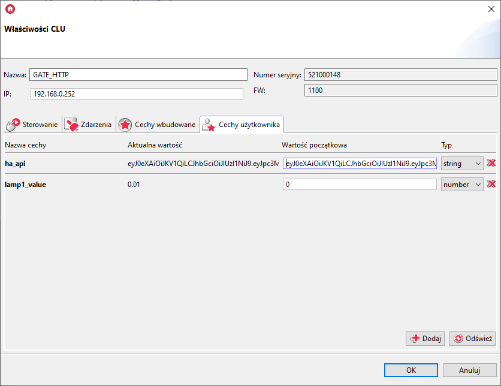


Następnie należy utworzyć obiekt wirtualny `HttpListener` oraz skonfigurować go w następujący sposób:

* `Path` - ścieżka zgodna ze ścieżką ustawioną w HA, np. "/HAlistener",
* `ResponseType` - ustawić na `JSON`.

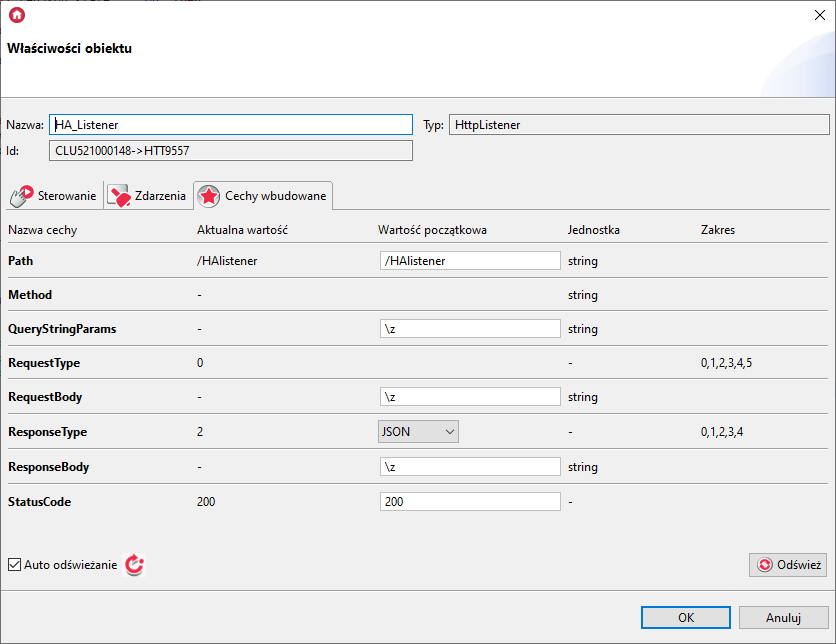


Do zdarzenia `OnRequest` obiektu `HttpListener` należy przypisać skrypt, który będzie rozpoznawał odebraną komendę i wykonywał żądaną akcję w systemie, przykładowo:

```lua
local reqJson = GATE_HTTP->HA_Listener->RequestBody

if reqJson ~= nil then
---------------------------------------------------
	if reqJson.object == "lamp1" then
		if reqJson.state == "on" then
			CLUZ->DIMMER->SwitchOn(0)
		elseif reqJson.state == "off" then
			CLUZ->DIMMER->SwitchOff(0)
		else
			GATE_HTTP->lamp1_value = reqJson.value/255
			CLUZ->DIMMER->SetValue(GATE_HTTP->lamp1_value)
		end
		resp = { Result = "OK" }
		code = 200
		
		
---------------------------------------------------		
	else
		resp = { Result = "Not Found" }
		code = 401
	end
---------------------------------------------------
else
	resp = { Result = "Not Found" }
	code = 404
end

GATE_HTTP->HA_Listener->SetStatusCode(code)
GATE_HTTP->HA_Listener->SetResponseBody(resp)
GATE_HTTP->HA_Listener->SendResponse()
```

Do skryptu należy dodać parametry `code`(number) i `resp`(string).

> Dla linijek:
>
> `GATE_HTTP->lamp_value = reqJson.value)/255
>  CLUZ->DIMMER->SetValue(GATE_HTTP->lamp_value)`
>
> Wartość value (wartość jasności ustawiona za pomocą suwaka w HA) jest zapisywana w zmiennej użytkownika (aby umożliwić operacje pomiędzy dwoma CLU) oraz podzielona przez 255, aby zmienić zakres z 0-255 na 0-1. 

> W przyszłości możliwe będzie zamienienie obu powyższych linijek na jedną, bez użycia zmiennej globalnej:
>
> `CLUZ->DIMMER->SetValue(tonumber(reqJson.value)/255)`
>
> Aktualnie jednak użycie cechy użytkownika jest niezbędne.


W tym momencie po wysłaniu konfiguracji można przetestować działanie komunikacji poprzez włączanie, wyłączanie lub zmianę jasności obiektu w Home Assistant.


###### 3.3. Konfiguracja aktualizacji stanu

Aby zmiany stanu w systemie były widoczne również w Home Assistant, należy odpowiednio aktualizować status po każdej zmianie. 

W pierwszej kolejności należy utworzyć obiekt wirtualny `HttpRequest` oraz skonfigurować go w następujący sposób:

* `Host` - ustawić adres oraz port dla serwera Home Assistant,
* `Method` - POST,
* `RequestType`, `ResponseType` - JSON.

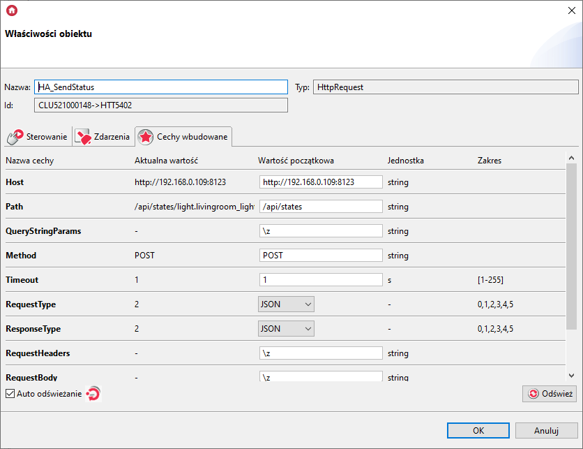


Następnie należy utworzyć skrypt wysyłający aktualizację stanu urządzenia:

```lua
local reqHeaders = "Authorization: Bearer "..GATE_HTTP->ha_api
local method = "POST"
local path
local eventJson

if module == "lamp1" then
	path = "/api/states/light.livingroom_light"
	if CLUZ->DIMMER->Value > 0 then
		val = val * 255;
		eventJson = {
		state = "on",
		attributes = { 
			brightness = val,
			friendly_name = "Lampa",
			supported_features = 1
			}
		}
	else
		eventJson = {
		state = "off",
		attributes = { 
			brightness = 0,
			friendly_name = "Lampa",
			supported_features = 1
			}
		}
	end
---------------------------------------------------------
end


GATE_HTTP->HA_SendStatus->SetRequestHeaders(reqHeaders)
GATE_HTTP->HA_SendStatus->SetPath(path)
GATE_HTTP->HA_SendStatus->SetMethod(method)
GATE_HTTP->HA_SendStatus->SetRequestBody(eventJson)
GATE_HTTP->HA_SendStatus->SendRequest()
```

Do skryptu należy dodać parametry:

* `module`(string) - do rozpoznawania modułu, który zmienił stan,
* `val`(number) - do przekazania wartości.

> Dla linijek:
>
> `local reqHeaders = "Authorization: Bearer "..GATE_HTTP->ha_api` 
>
> W tym miejscu został ustawiony przygotowany wcześniej token.
>
> `path = "/api/states/light.livingroom_light"`
>
> W tym miejscu została utworzona ścieżka dla aktualizowanego obiektu w HA.
>
> `val = val * 255;`
>
> Wartość value DIMMERA pomnożona przez 255, aby uzyskać zakres 0-255.
>
> ```
> attributes = { 
> 			brightness = val,
> 			friendly_name = "Lampa",
> 			supported_features = 1
> 			}
> ```
>
> Jako, że podczas aktualizacji stanu Home Assistant pozostałe atrybuty zostają również zaktualizowane, należy umieścić je również w skrypcie, aby nie zostały usunięte podczas aktualizacji.


Do zdarzenia `OnValueChange` obiektu DIMMER, należy przypisać utworzony skrypt z odpowiednio ustawionymi parametrami:

* `module` = "lamp1" - do zidentyfikowania w skrypcie,
* `val` = `CLUZ->DIMMER->Value` - aktualna wartość cechy Value

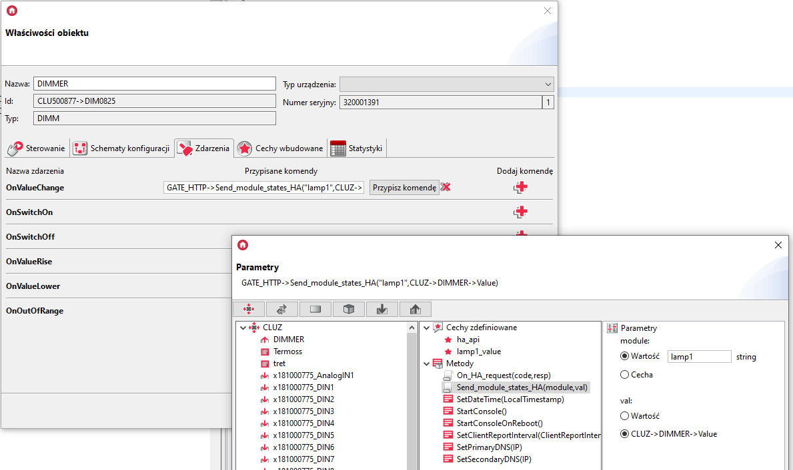


Po wysłaniu konfiguracji można przetestować, czy zmiany stanu w systemie powodują prawidłowe zmiany stanu w Home Assistant.


##### 4. Integracja z Google Home / Asystentem Google

Integrację z Google Home dzięki Home Assistant można wykonać na dwa sposoby:

* W prosty sposób wykorzystując Home Assistant Cloud (płatna subskrybcja 5$/miesiąc),
* Wykonać bezpłatną integrację z Google Home za pomocą Google Cloud API Console.

Szczegółowe informacje można znaleźć bezpośrednio na [Google Assistant - Home Assistant (home-assistant.io)](https://www.home-assistant.io/integrations/google_assistant).


###### A. Integracja poprzez Home Assistant Cloud (subskrybcja)

Integrację poprzez chmurę Home Assistant można przetestować przez miesiąc za darmo, wystarczy to do przetestowania działania.

W pierwszej kolejności należy utworzyć konto/zalogować się do `Nabu Casa` (Chmura HA). Aby to zrobić należy otworzyć `Konfiguracja -> Home Assistant Cloud`.

Po poprawnym zalogowaniu się należy zaznaczyć `Asystent Google` w konfiguracji poniżej.

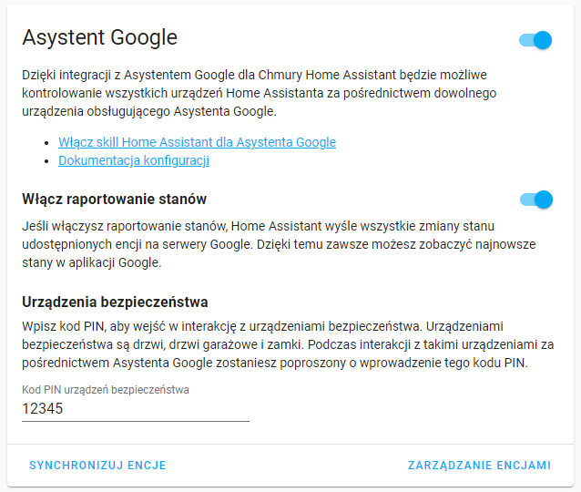


Ostatnim krokiem jest połączenie z chmurą HA w aplikacji Google Home. W tym celu należy otworzyć aplikację Home, wybrać `Skonfiguruj urządzenie -> Obsługiwane przez Google` następnie wyszukać `Home Assistant Cloud by Nabu Casa` i zalogować się na swoje konto.


Po poprawnym połączeniu, na ekranie pojawią się połączone urządzenia, które można przypisać do danego pomieszczenia w aplikacji.


W tym momencie można przetestować sterowanie za pomocą Google Home, lub poprzez Asystenta Google, używając przykładowych komend:

- "Włącz/Wyłącz światło w Salonie"
- "Zapal/Zgaś wszystkie światła"
- "Wyłącz/Włącz Lampa w Salonie"
- "Włącz światło w Salonie na 20%"
- "Zwiększ/Zmniejsz jasność światła w Salonie"


###### B. Integracja poprzez Google Cloud API Console (bezpłatna)

W pierwszej kolejności należy ustawić przekierowywanie portu w routerze, aby mieć połączenie zewnętrzne z Home Assistant. 

> Przedstawiony poniżej sposób powinien działać również dla zmiennego, ale koniecznie zewnętrznego adresu IP.

Aby skonfigurować przekierowywanie portów należy otworzyć ustawienia routera i wyszukać `Port Forwarding`. Należy ustawić przekierowywanie portu 8123 na ten sam port z naszym HA, przykładowo:


Po ustawieniu portu można przetestować, czy po wpisaniu adresu `http://<Twój zewnętrzny adres IP>:8123/` pojawia się okno logowania do Home Assistant. 

W kolejnym kroku należy otworzyć stronę [Duck DNS (www.duckdns.org)](https://www.duckdns.org/), zalogować się i stworzyć nazwę domeny, przykładowo: `examplegrenton.duckdns.org`

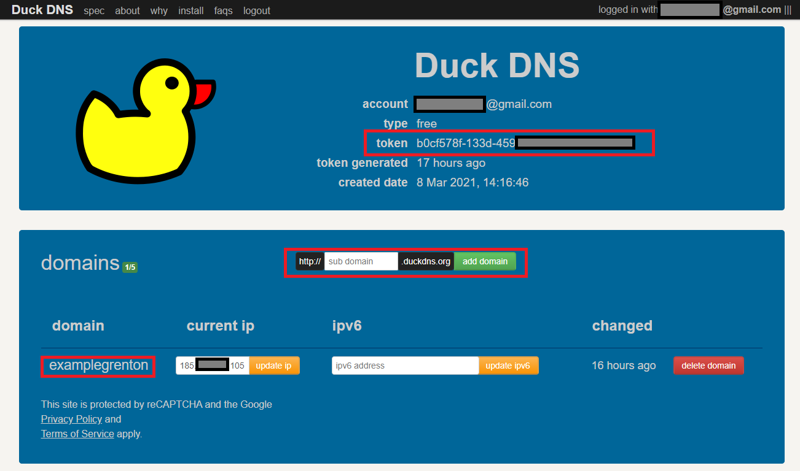


Następnie w HA zainstalować `add-on` o nazwie `Duck DNS`. Przed uruchomieniem należy skonfigurować go w zakładce `Konfiguracja` w następujący sposób:

```yaml
lets_encrypt:
  accept_terms: true
  certfile: fullchain.pem
  keyfile: privkey.pem
token: b0cf578f-133d-4598-xxxx <twój token>
domains:
  - <twoja nazwa>.duckdns.org
aliases: []
seconds: 300
```

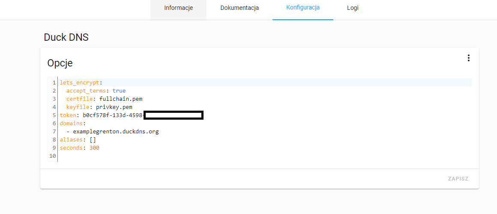

Po skonfigurowaniu można uruchomić add-on klikając `URUCHOM`. 

W pliku `configuration.yaml` należy dodać kod:

```yaml
http:
  base_url: https://<twoja nazwa>.duckdns.org:8123
  ssl_certificate: /ssl/fullchain.pem
  ssl_key: /ssl/privkey.pem
```


W tym miejscu należy zapisać plik i uruchomić ponownie serwer HA.

> UWAGA!!
>
> **Po zrestartowaniu serwera logowanie do Home Assistant odbywać się będzie za pomocą adresu poprzedzonego "https://" !!!!!!!!**. W innym przypadku strona nie będzie odnajdywana. Jeśli przeglądarka zablokuje stronę, należy wyłączyć ostrzeżenie i przejść do strony.
>
> 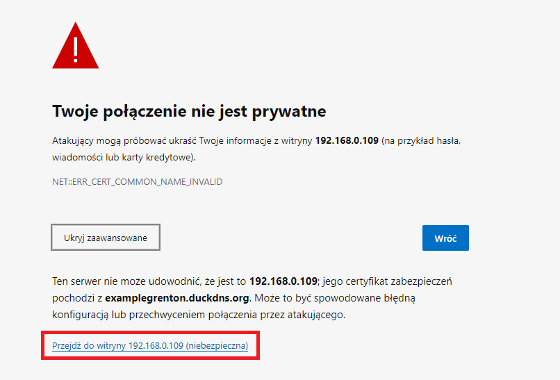


> UWAGA!!
>
> Zmianę należy również wprowadzić dla obiektu wirtualnego Http Request. Należy dopisać "https" w `Host`.  W innym wypadku nie będzie działać aktualizacja stanu urządzeń z Grenton.
> 
>
> 


Po zrestartowaniu serwera należy sprawdzić, czy pod adresem `https://<twoja nazwa>.duckdns.org:8123/` uruchamia się strona logowania Home Assistant. Jeśli tak, można przejść dalej.


W następnym kroku przechodzimy do strony [Actions on Google](https://console.actions.google.com/), logujemy się za pomocą konta Google i tworzymy nowy projekt, przykładowo o nazwie "Smart Home". Po utworzeniu projektu klikamy `Smart Home` a następnie `Start Building`.


Następnie zostanie wyświetlone okno:

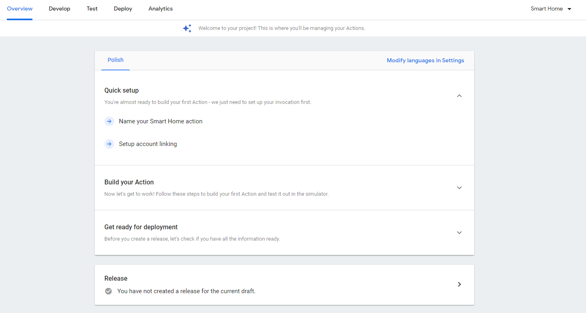

Wybieramy `Quick setup` -> `Name your Smart Home action`. W tym oknie nadajemy nazwę, która następnie będzie wyświetlana w Google Home podczas konfiguracji, przykładowo "HA Smart Home". Zapisujemy i powracamy do okna `Overview`.

Następnie klikamy trzy kropki w prawym górnym rogu i otwieramy `Project settings`. Z tego miejsca kopiujemy `Project ID` naszego projektu.

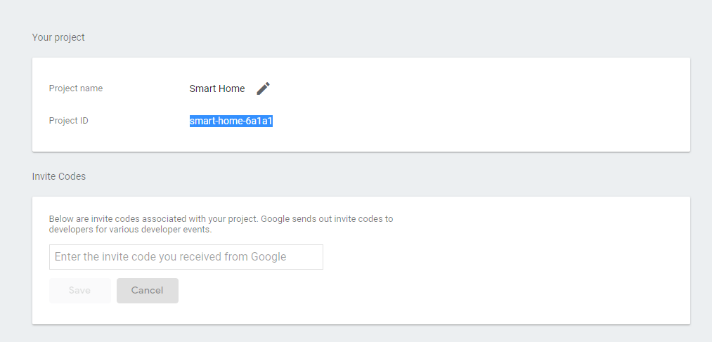

Wybieramy `Quick setup` -> `Setup account linking`. Konfigurujemy następująco:

- Client ID..: `https://oauth-redirect.googleusercontent.com/r/<ID projektu>`

* Client secret: `Cokolwiek` nie jest to istotne przy konfiguracji HA
* Authorization URL: `https://<twoja nazwa>.duckdns.org:8123/auth/authorize`
* Token URL: `https://<twoja nazwa>.duckdns.org:8123/auth/token`

W Configure your client tworzymy dwa `Scopes` - `email` oraz `name`.

> Pole `Google to transmit clientID and secret via HTTP basic auth header` pozostawiamy odznaczone.

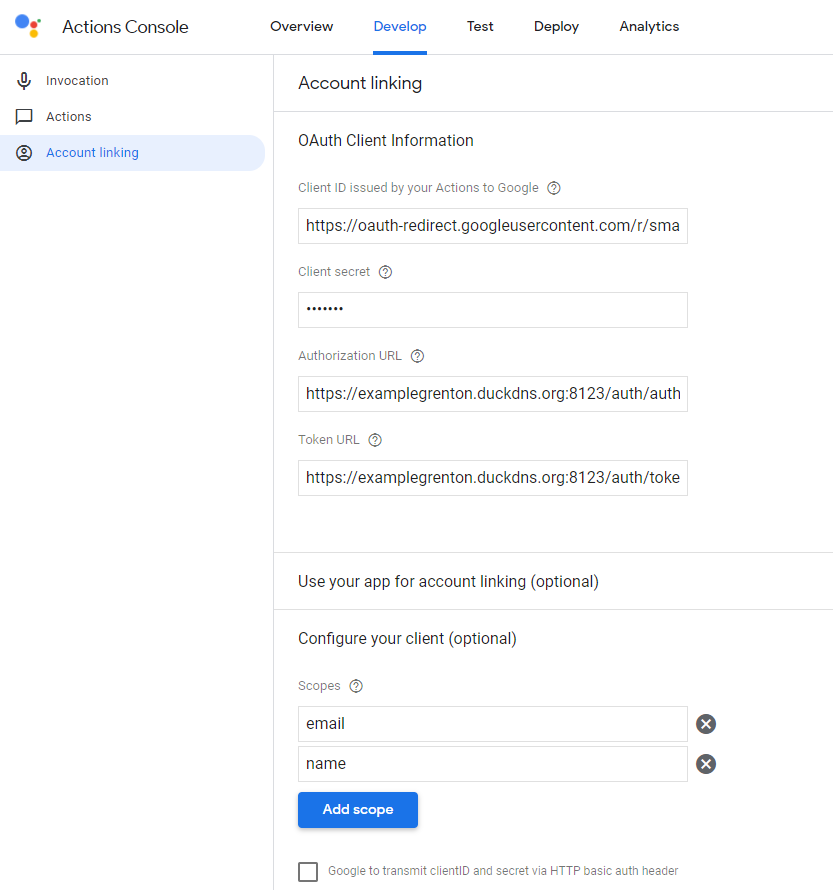

Zapisujemy i powracamy do okna `Overview`. Wybieramy `Build your Action` -> `Add Actions(s)`.

W polu `Fulfillment URL` wpisujemy `https://<twoja nazwa>.duckdns.org:8123/api/google_assistant`


Zapisujemy i powracamy do panelu Home Assistant.

W `configuration.yaml` dopisujemy:

```yaml
google_assistant:
  project_id: hassio-669da
  report_state: false
  exposed_domains:
    - light
  entity_config:
    light.livingroom_light:
      name : Lampa
      expose: true
```

Zapisujemy plik i uruchamiamy ponownie serwer HA.

Ostatnim krokiem będzie uruchomienie aplikacji Google Home i połączenie się z utworzonym kontem. Należy wybrać `Skonfiguruj nowe urządzenie`-> `Obsługiwane przez Google` i wyszukać "test":


Po zalogowaniu się do Home Assistant wskazane w pliku `configutarion.yaml` urządzenia zostaną dodane do aplikacji, w której można przypisać je do odpowiednich miejsc.


W tym momencie można przetestować sterowanie za pomocą Google Home, lub poprzez Asystenta Google, używając przykładowych komend:

- "Włącz/Wyłącz światło w Salonie"
- "Zapal/Zgaś wszystkie światła"
- "Wyłącz/Włącz Lampa w Salonie"
- "Włącz światło w Salonie na 20%"
- "Zwiększ/Zmniejsz jasność światła w Salonie"


Każde nowo skonfigurowane urządzenie w pliku `configuration.yaml` powinno pokazać się w Google Home po odświeżeniu okna. 

Aby skonfigurować aktualizację stanów urządzeń, należy w pierwszej kolejności przejść do strony https://console.cloud.google.com/apis/credentials/serviceaccountkey i wybrać odpowiedni projekt. Należy wybrać `Nowe konto usługi`, wpisać dowolną nazwę oraz wybrać rolę `Właściciel`. Po utworzeniu pliku JSON zostanie on pobrany.


Pobrany plik należy umieścić w katalogu config w Home Assistant. Można do tego wykorzystać add-on `File editor`:

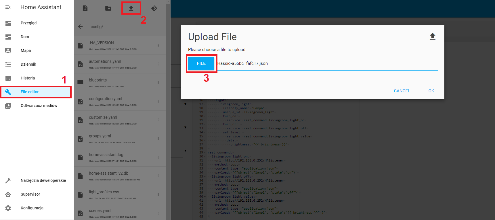


Następnie należy edytować konfigurację google_assistant w pliku `configuration.yaml` dodając `service_account: !include <nazwa pliku>.json` oraz zmieniając `report_state` na `true`:

```
google_assistant:
  project_id: hassio-669da
  service_account: !include Hassio-62c0f8e5b2e0.json
  report_state: true
  exposed_domains:
    - light
  entity_config:
    light.livingroom_light:
      name : Lampa
      expose: true
```

Po zakończeniu należy zapisać i uruchomić ponownie serwer HA.


Ostatnim krokiem będzie przejście do [Google API Console](https://console.cloud.google.com/apis/api/homegraph.googleapis.com/overview), wybranie odpowiedniego projektu oraz `Włączenie HomeGraph API`.


GOTOWE!
Można przetestować, czy zmiany stanu w systemie powodują również zmiany stanu w aplikacji Google Home.